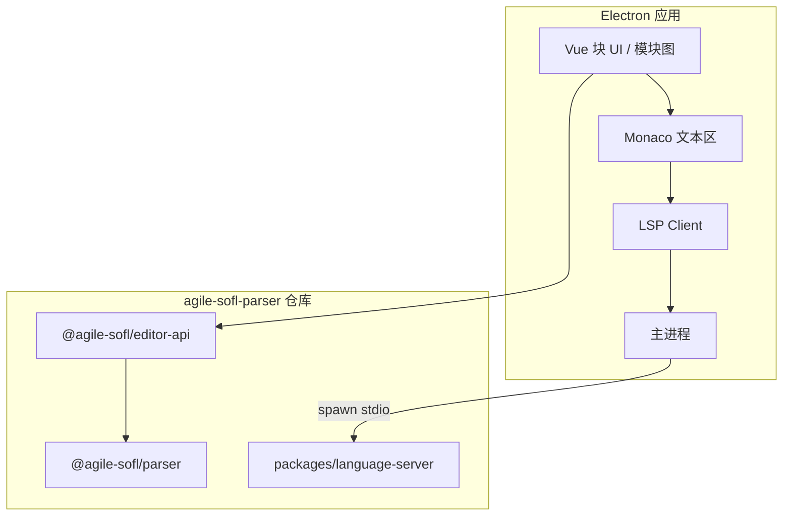

# 12 — Electron 编辑器集成

本文档说明 **独立 Electron + Vue 可视化编辑器** 如何消费本仓库 npm 包与 LSP，与 VS Code 扩展（纯文本 + LSP）分工明确。

## 1. 架构



| 通道 | 用途 |
|------|------|
| **LSP** | 补全、hover、semantic tokens、格式化、单文件 definition |
| **editor-api + parser** | 文档/FSF/模块图 JSON 模型、批量 patch、全项目 `ProjectIndex` |
| **Monaco markers** | 可用 `check()` 或 LSP `publishDiagnostics` |

## 2. npm 依赖

```json
{
  "dependencies": {
    "@agile-sofl/parser": "^0.1.0",
    "@agile-sofl/editor-api": "^0.1.0"
  }
}
```

本地联调（monorepo 同级目录）：

```json
"@agile-sofl/parser": "file:../agile-sofl-parser",
"@agile-sofl/editor-api": "file:../agile-sofl-parser/packages/editor-api"
```

## 3. 主进程：spawn LSP

参考实现：`packages/studio/src/main/lsp.ts`

```javascript
import { spawn } from 'node:child_process'
import { join } from 'node:path'

const serverJs = join(
  require.resolve('@agile-sofl/language-server/package.json'),
  '..',
  'dist',
  'server.js'
)

const lsp = spawn(process.execPath, [serverJs, '--stdio'], {
  stdio: ['pipe', 'pipe', 'inherit']
})
// 将 lsp.stdin / lsp.stdout 与渲染进程 JSON-RPC 桥接
```

或使用 `vscode-languageclient` / `monaco-languageclient` 在渲染进程封装协议。

构建 LSP（若从源码）：

```bash
npm run build --workspace @agile-sofl/language-server
npm run bundle --workspace @agile-sofl/language-server
```

## 4. Editor API 表

| 函数 | 返回 | Vue 用途 |
|------|------|----------|
| `buildDocumentModel(source)` | `{ modules, diagnostics, errorCount }` | 侧边栏、状态栏 |
| `buildHybridRegions(ast)` | `HybridRegion[]` | 与 Monaco 装饰对齐 |
| `buildFsfModel(process, source)` | `FsfModelDto` | FSF 表单块 |
| `buildModuleGraph(ast)` | `{ nodes, edges }` | 力导向/树图 |
| `buildSymbolIndex(ast, source)` | 扁平符号 | 大纲、跳转列表 |
| `patchFsfSpec(source, process, scenarios, others?)` | 新 source | 表单保存 |
| `patchComment` / `patchDecom` / `patchInformal` | 新 source | 非形式块编辑 |
| `formatDocument(source)` | 格式化文本 | 全量排版 |
| `ProjectIndex.scan(rootDir)` | — | 磁盘规格目录索引 |
| `checkIncremental(source, prev?)` | `{ ast, diagnostics, state }` | 大文件编辑缓存 |

DTO 均为 **JSON 可序列化**（无 AST 循环引用），便于 IPC。

## 5. 典型数据流

### 5.1 打开项目

1. 主进程 `ProjectIndex.scan(specRoot)`
2. 渲染进程对每个打开文件：`buildDocumentModel` + `buildModuleGraph`（合并或按文件）
3. 可选：LSP `didOpen` 同步各 `.asfl`

### 5.2 编辑 FSF 块

1. Vue 表单绑定 `FsfModelDto.scenarios`
2. 保存：`patchFsfSpec(source, processName, scenarios)` → 写回 Monaco / 磁盘
3. `checkIncremental(newSource, prevState)` 更新诊断

### 5.3 跨文件跳转

1. `ProjectIndex.findDefinition(uri, offset)` → `{ uri, target }`
2. Monaco 打开 `uri` 并 `revealRange`

LSP 单文件 `definition` 在仅打开当前文件时仍可用；多文件规格应优先 `ProjectIndex`。

## 6. 与 VS Code 扩展的差异

| 能力 | VS Code 扩展 | Electron + Vue |
|------|--------------|----------------|
| 文本 + LSP | ✅ | ✅ |
| Hybrid 背景装饰 | ✅ POC | 可选 |
| FSF 表单块 | ❌ | ✅（Vue） |
| 模块关系图 canvas | ❌ | ✅（Vue） |
| 全目录 ProjectIndex | 部分（已打开文档） | ✅ 主进程 scan |

## 7. 测试边界

| 本仓库 | Electron 项目 |
|--------|----------------|
| `packages/editor-api/tests/contract.test.ts` | Playwright：块 UI、模块图 |
| LSP + `ProjectIndex` 单测 | Electron E2E |
| `packages/studio` smoke + LSP spawn | 生产 UI |

## 8. 版本与发版

- `@agile-sofl/parser`：npm 独立发版
- `@agile-sofl/editor-api`：随仓库或独立 npm（当前 workspace 内 `packages/editor-api`）
- Language Server：**不单独发 npm**；Electron 可 `file:` 引用 `packages/language-server` 或复制 `dist/server.js`

详见 [08-API与CLI.md](./08-API与CLI.md)、[10-编辑器路线图.md](./10-编辑器路线图.md)、[11-VSCode扩展与LSP.md](./11-VSCode扩展与LSP.md)、[14-Studio-UI设计规约.md](./14-Studio-UI设计规约.md)。
