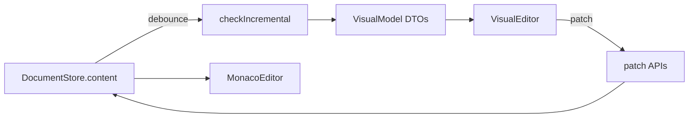

# 15 — Studio 可视化编辑器

Agile-SOFL Studio 可视化编辑架构与同步协议。与 [12-Electron编辑器集成.md](./12-Electron编辑器集成.md)、[14-Studio-UI设计规约.md](./14-Studio-UI设计规约.md) 互补。

## 1. 设计原则

- **单一事实来源**：`.asfl` 文本存于 Pinia `document` store；Monaco 与可视化面板均为视图。
- **派生模型**：可视化 UI 消费 `@agile-sofl/editor-api` 的 JSON DTO，不直接突变 AST。
- **Patch 写回**：可视化编辑通过 `patchFsfSpec`、`patchComment`、`patchDecom`、`patchDeclaration` 等函数生成新文本。
- **实时同步**：代码变更 debounce 300ms 后重建 DTO；可视化 patch 立即写回 store 并更新 Monaco model。

## 2. 数据流

## 3. VisualModel DTO

| 字段 | 来源 | 用途 |
|------|------|------|
| `documentModel` | `buildDocumentModel` | 模块列表、诊断计数 |
| `moduleGraph` | `buildModuleGraph` | 模块关系图导航 |
| `fsfModels` | `buildAllFsfModels` | FSF 场景表单 |
| `modules[].consts/types/vars` | AST + `sliceText` | 声明表单（含 `text`/`span`） |
| `parseFailed` | `buildVisualModelTolerant` | 仅当完全无 `ProgramNode` 时为 true |
| `hasDiagnostics` | 同上 | 存在 error 级诊断（不阻断树/图浏览） |

## 4. 组件结构（Phase 2b）

| 组件 | 路径 | 职责 |
|------|------|------|
| `VisualEditor` | `components/editor/visual/VisualEditor.vue` | 根容器 |
| `VisualToolbar` | `components/editor/visual/VisualToolbar.vue` | 独立工具栏：刷新、应用、添加声明/场景、树/图切换 |
| `ModuleTree` | `components/editor/visual/ModuleTree.vue` | 模块/进程/函数树 |
| `ModuleGraphView` | `components/editor/visual/ModuleGraphView.vue` | SVG 关系图导航 |
| `ModuleOverview` | `components/editor/visual/ModuleOverview.vue` | const/type/var 可编辑表单 |
| `DeclarationEditor` | `components/editor/visual/DeclarationEditor.vue` | 声明 CRUD 表格 |
| `ProcessEditor` | `components/editor/visual/ProcessEditor.vue` | 签名/ext/decom/comment/FSF |
| `AliasProcessEditor` | `components/editor/visual/AliasProcessEditor.vue` | equal 别名进程 |
| `FunctionEditor` | `components/editor/visual/FunctionEditor.vue` | 签名/函数体/FSF |
| `ExtBlockEditor` / `SignatureEditor` | `components/editor/visual/` | ext 块与签名编辑 |
| `ui/*` | `components/editor/visual/ui/` | `CodeField`、`SectionCard`、`FormField` 等 |
| `FsfScenarioEditor` | `components/editor/visual/FsfScenarioEditor.vue` | FSF 场景表格 |
| `ParseErrorBanner` | `components/editor/visual/ParseErrorBanner.vue` | 解析错误提示 |

Composable：`composables/useVisualModel.ts` — debounced parse、patch 循环防护、`rebuildNow()`、`patchDeclaration()`。

## 5. 同步协议

### 代码 → 可视化

1. 监听 `activeTab.content`
2. 300ms debounce 后调用 `buildVisualModelTolerant(source)`
3. 重建 `ast`、`documentModel`、`fsfModels`、声明 DTO

### 可视化 → 代码

1. 用户编辑 FSF / decom / comment / 声明
2. 调用对应 `patchXxx(source, ...)` 得到新文本
3. `document.setContent(tabId, newSource)` 标记 dirty
4. Monaco watch 同步 model；`lastRebuiltContent` 避免重复 parse

子编辑器（Process/Declaration/Function/FSF）即时 emit patch；`scheduleVisualPatch` 统一 400ms debounce。FSF 谓词 parse 错误时阻止写回。

Phase 5–6 已覆盖 ext、结构化签名、别名进程、模块 CRUD、Init 进程、SYSTEM 模块、分级诊断面板；后续见 [16-Studio可视化编辑器迭代.md](./16-Studio可视化编辑器迭代.md)。

## 6. 视图模式

默认 **双栏**（`split`）：左 Monaco、右 VisualEditor。工具栏顺序：双栏 / 代码 / 可视化。

- **代码工具栏**：小地图、行号、格式化（`Shift+Alt+F` 或 Edit 菜单）
- **可视化工具栏**：刷新、全部应用、添加声明、树/关系图切换

## 7. Monaco 格式化

- LSP 在线：`textDocument/formatting`
- Fallback：IPC `studio:format-document` → `formatDocument(source)`

## 8. 阶段路线图

| 阶段 | 覆盖 | 编辑 |
|------|------|------|
| **2a** | 模块树、FSF 表单 | FSF / decom / comment |
| **2b** | 声明 CRUD、VisualToolbar、关系图导航 | const/type/var + 进程字段 |
| **2c（当前）** | 进程/函数 CRUD、`InvariantPanel`、关系图 hover/边标签 | `patchProcess` IPC |
| **2d（当前）** | 双栏代码联动、breadcrumb、诊断跳转 | `revealSpan` + 高亮装饰 |

## 9. UX 打磨（Phase 2c/2d）

### 统一撤回栈

- Store：`stores/documentHistory.ts`，按 tab 维护 `undoStack` / `redoStack`
- Monaco 输入 debounce 300ms 合并快照；可视化 patch 立即 `pushSnapshot`
- Undo/Redo 经 `EditorWorkspace.applyContent` 写回并 `pushStackElement` 重置 Monaco 内部栈

### 剪贴板与小地图

- Monaco 焦点时不拦截 Ctrl+C/V/X/A；非 Monaco 使用 `editor.action.clipboard*` action
- 小地图：`showRegionSectionHeaders: false`、`renderCharacters: false`

### 滚动条

- `main.css` 全局 `--scrollbar-*` 变量与 `.studio-scroll` 圆角细滚动条
- Monaco `.scrollbar .slider` 与 Studio 主题一致

### 代码联动

- `VisualEditor` breadcrumb（模块 › 进程/函数）
- 树/图/声明/不变式/诊断点击 → `@reveal-span` → `MonacoEditor.revealSpan`（行高亮 2s）
- `ParseErrorBanner` 列出前 8 条诊断并可跳转

### VisualModel 扩展

| 字段 | 用途 |
|------|------|
| `diagnostics[]` | 解析/语义诊断，含 `span` |
| `modules[].invariants[]` | 不变式文本与 `span` |
| `modules[].processes[].span` | 进程块定位 |
| `modules[].functions[]` | `name` + `text` + `span`（树显示 `fn.name`） |

### 进程/函数 patch

- `@agile-sofl/editor-api`：`processPatch.ts`（`addProcess` / `removeProcess` / `addFunction` / …）
- IPC：`studio:patch-process`；工具栏「添加进程」「添加函数」

## 10. 布局与 i18n（Round 2）

### 工具栏（Phase 2，已由 Phase 3 调整）

- **主工具栏**（`EditorToolbar`）：仅 `双栏 | 代码 | 可视化`
- **可视化工具栏**（`VisualToolbar`）：左侧 `树形 | 关系图`；关系图模式下缩放数字 +「适应窗口」；搜索框；刷新/应用/CRUD

### 可视化面板分栏

- 内层 `ResizableSplit`：左侧导航（树或关系图）| 右侧详情，可拖拽调整宽度
- `editorUi.visualNavRatio`：树形默认约 22%，关系图默认 **50%**（`localStorage` 持久化）
- 关系图/树组件不再使用固定 `w-56`

### 代码 ↔ 可视化同步

- `useVisualModel`：`lastRebuiltContent` 避免重复 parse；可视化 patch 后不再用 `skipNextParse` 吞掉代码编辑
- `rebuildNow` / 手动刷新：`resetVisualChannel` 清空增量状态
- `parseFailed` 从 `true→false` 时自动重建
- 详情子组件 `:key` 含 `modelGen`，避免修复代码后表单草稿残留

### 工作区与 Monaco 中文

- 切换 Studio 语言 **不 reload**，tab 与未保存内容保留；`sessionStorage` 快照作崩溃恢复
- Monaco 右键中文：`monaco-editor-nls-adapter` + `optimizeDeps.exclude: ['monaco-editor']`（dev 须走 NLS 插件而非预构建包）

## 11. Phase 3 — 容错解析、图视口与交互

### 容错可视化

- IPC `studio:build-visual-model` 使用 `buildVisualModelTolerant`（`parse()` 默认 tolerant），不再经 `checkIncremental` 的 strict 路径
- `parseFailed`：仅 `ast == null`；`hasDiagnostics`：存在 error 诊断
- 有部分 AST 时仍构建 `moduleGraph` / `modules` DTO；`ParseErrorBanner` 截断长 `Expecting…` 消息，可展开详情
- 写操作（patch/CRUD）在 `hasDiagnostics` 时禁用；树/图导航与只读浏览不受影响

### 关系图视口与复合节点

- `useGraphViewport`：默认 `cursor: grab` 拖拽平移；滚轮垂直平移；Ctrl+滚轮以指针为中心缩放
- 切换至关系图或数据变更时 `fitToView()`；`editorUi.graphZoomPercent`（25–200%）与工具栏数字输入双向同步
- **UML 式复合模块**（`buildModuleGraphLayout`）：模块为大容器，内部分区「子模块 / 进程 / 函数」，分隔线区隔；子模块嵌套在父模块框内
- `decom` 边仅当目标进程/函数名可解析时绘制，避免指向空白；模块 `parent` 包含关系不画外连线
- `GraphActionsMenu`：导出 SVG/PNG（主题/倍率）、视图内 **Tidy** 排序；`data-graph-ui` 避免被视口 pointer capture 拦截
- 关系图 **grid 布局**：进程/函数/子模块分区多列排版；绘制顺序按 `depth`（父在后、子在前）
- 树与图 **hover**：进程 `comment`/`decom`、函数签名摘要

### 编辑即同步（Phase 4）

- 可视化字段 **400ms debounced auto-patch**，已移除 Apply / Apply All 按钮
- `scheduleVisualPatch` + `documentHistory` **coalesce key**（同字段 2s 内合并 undo）
- 解析失败或有 error 诊断时禁用写入，显示 banner
- **FunctionEditor**：编辑 `==` 函数体与 FSF（`patchFunction` IPC）
- **PredicateBuilder**：FSF Test/Def 代码/可视化双模式；模块符号补全；支持 and/or/not/quantified/relational 节点增删改、叶子 `CodeField` 补全、量化词 binding 真实类型与 nested quantifiers 往返

## 14. Phase 4 — Grid、实时同步、函数与 FSF 构建器

| 里程碑 | 内容 |
|--------|------|
| M1 | 宽度优先 grid 多列布局、有界嵌套子模块（compact chip + clipPath）、`GraphActionsMenu` 导出 |
| M2 | debounced patch、history 合并、去 Apply |
| M3 | `patchFunction`、`FunctionEditor`（签名只读展示 + 函数体 + FSF） |
| M4 | `predicateModel`（binding 类型、`nestedQuantifiers`、re-parse 往返）、完整 `PredicateBuilder` 节点 UI |

### 关系图 grid 布局（Phase 4 布局修复）

- **铺满规则**：≤3 项单行；4 项 2×2；5 项 3+2；6 项 3+3；由 `targetGridCols` 驱动
- **子模块完整 compound**：嵌套模块显示与系统模块相同的 header/sections 结构，不再降级为 compact chip
- **有界嵌套**：子模块 cell 使用 natural 测量尺寸；`clipPath` 防止绘制溢出
- **交互**：默认选择工具（指针光标）；平移工具切换后 grab 光标；点子模块定位 `module.span`
- **导出**：SVG/PNG 克隆时清除 viewport transform，不受 pan/zoom 影响

### Predicate Builder（Phase 4 FSF 成品化）

- IPC：`parsePredicateUi` / `uiToPredicateText`（Visual 编辑后 re-parse 合并 AST）
- **MiniMonacoField**：FSF Test/Def/Others 与 predicate 叶子字段使用 Monaco（语法高亮 + 符号补全）
- 节点：`PredicateAndOrNode`、`PredicateQuantifiedNode`、`PredicateRelationalNode`、`AddNodeMenu`；各节点可 Wrap/Remove not
- FSF：`FsfScenarioEditor` 场景拖拽排序、场景级 parse 错误展示

### 交互（Phase 3）

- `VisualContextMenu`：树与图右键统一动作（定位代码、添加/删除进程与函数等）
- `ModuleTree`：进程拖拽仅调整列表顺序（`localStorage`，不写回源码）；双击等同选中并定位
- `VisualIssuesPanel`：编辑器工作区底部固定面板（code/visual/split 均可见），合并 parse、FSF、LSP 诊断并标注来源；visual 模式按选中模块/进程/函数过滤
- 全局 `Ctrl+C/V/X`：在 `.visual-panel` / `.studio-text-selectable` 内有选区时放行原生剪贴板
- 滚动条 `--scrollbar-size: 6px`；Vite `sourcemapIgnoreList` 忽略 `monaco-editor` 路径

### 测试

- `packages/editor-api/tests/visualPatchRoundtrip.test.ts` — 可视化 patch 同步协议验收矩阵（comment/decom/declaration/ext/signature/invariant/fsf/function）
- `packages/editor-api/tests/patchProcessFields.test.ts` — comment/decom 无双重前缀
- `packages/editor-api/tests/phase7Patch.test.ts` — 签名校验、Init 创建 roundtrip
- `packages/editor-api/tests/filterDiagnostics.test.ts` — 诊断按 selection 过滤
- `packages/editor-api/tests/mergeDiagnostics.test.ts` — parse/fsf/LSP 诊断合并与去重
- `packages/editor-api/tests/visualParse.test.ts` — tolerant fixture 仍有 modules
- `packages/studio/tests/truncateDiagnostic.test.ts`、`editCommands.test.ts`

## 12. 语法高亮配色（浅色 / 深色）

- 单一来源：`packages/vscode/scripts/syntax-palettes.json`（TextMate + LSP semantic）
- Studio Monaco：`themes.ts` 读取该 JSON；浅色采用 VS Code Light+ 风格（如运算符 `#333333`、标识符 `#001080`），深色保持原 Dark+ 配色
- VS Code 扩展：`npm run sync-token-colors` 写入 `editor.tokenColorCustomizations` 的 `[*Light*]` / `[*Dark*]` 与 `semanticTokenColorCustomizations`
- 修改配色后：更新 JSON → `vscode` 下 `sync-token-colors` → 重启 Studio / 重载 VS Code 窗口

## 13. LSP 与高亮

- LSP spawn 策略链：系统 Node → `ELECTRON_RUN_AS_NODE` → `utilityProcess`
- 关闭时先 `stopLanguageServer()` 再销毁窗口，避免 `Object has been destroyed`
- TextMate scope 经 `highlight-scope-map.json` 映射为 Monaco theme token
- 小地图：`renderCharacters: false`、`showRegionSectionHeaders: false`
