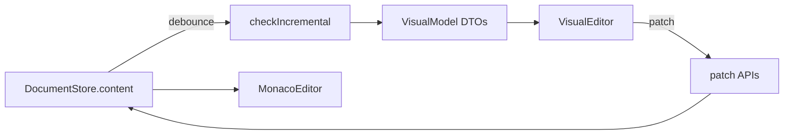

# 15 — Studio 可视化编辑器

Agile-SOFL Studio 可视化编辑架构与同步协议。与 [12-Electron编辑器集成.md](./12-Electron编辑器集成.md)、[14-Studio-UI设计规约.md](./14-Studio-UI设计规约.md) 互补。

## 1. 设计原则

- **单一事实来源**：`.asfl` 文本存于 Pinia `document` store；Monaco 与可视化面板均为视图。
- **派生模型**：可视化 UI 消费 `@agile-sofl/editor-api` 的 JSON DTO，不直接突变 AST。
- **Patch 写回**：可视化编辑通过 `patchFsfSpec`、`patchComment`、`patchDecom` 等函数生成新文本。
- **实时同步**：代码变更 debounce 300ms 后重建 DTO；可视化 patch 立即写回 store 并更新 Monaco model。

## 2. 数据流

## 3. VisualModel DTO

| 字段 | 来源 | 用途 |
|------|------|------|
| `documentModel` | `buildDocumentModel` | 模块列表、诊断计数 |
| `moduleGraph` | `buildModuleGraph` | 模块/进程/函数节点（Phase 2c 图） |
| `fsfModels` | `buildAllFsfModels` | FSF 场景表单 |
| `parseFailed` | `checkIncremental` | 解析失败横幅 |

## 4. 组件结构（Phase 2a）

| 组件 | 路径 | 职责 |
|------|------|------|
| `VisualEditor` | `components/editor/visual/VisualEditor.vue` | 根容器 |
| `ModuleTree` | `components/editor/visual/ModuleTree.vue` | 模块/进程/函数树 |
| `ModuleOverview` | `components/editor/visual/ModuleOverview.vue` | 声明只读展示 |
| `ProcessEditor` | `components/editor/visual/ProcessEditor.vue` | decom/comment/FSF |
| `FsfScenarioEditor` | `components/editor/visual/FsfScenarioEditor.vue` | FSF 场景表格 |
| `ParseErrorBanner` | `components/editor/visual/ParseErrorBanner.vue` | 解析错误提示 |

Composable：`composables/useVisualModel.ts` — debounced parse、patch 循环防护。

## 5. 同步协议

### 代码 → 可视化

1. 监听 `activeTab.content`
2. 300ms debounce 后调用 `checkIncremental(source, state)`
3. 重建 `ast`、`documentModel`、`fsfModels`

### 可视化 → 代码

1. 用户编辑 FSF / decom / comment
2. 调用 `patchXxx(source, ...)` 得到新文本
3. `document.setContent(tabId, newSource)` 标记 dirty
4. Monaco watch 同步 model；`skipNextParse` 避免重复 parse

## 6. 视图模式

默认 **双栏**（`split`）：左 Monaco、右 VisualEditor。工具栏顺序：双栏 / 代码 / 可视化。

## 7. 新建模板

`packages/studio/templates/manifest.json` 定义模板；`copy-editor-assets.mjs` 复制至 `public/templates/`。`Ctrl+N` 打开 `NewFileDialog` 选择空白或示例。

## 8. 阶段路线图

| 阶段 | 覆盖 | 编辑 |
|------|------|------|
| **2a（当前）** | 模块树、声明只读、FSF 表单 | FSF / decom / comment |
| **2b** | type/var/const 表单、ext 块 | 声明增删改 |
| **2c** | 模块关系图 canvas | 进程/函数 CRUD |
| **2d** | invariant 谓词 builder | 完整 ASFL 图形化 |

## 9. LSP 与高亮

- LSP spawn 策略链：`utilityProcess.fork` → 系统 Node → `ELECTRON_RUN_AS_NODE`
- TextMate scope 经 `highlight-scope-map.json` 映射为 Monaco theme token（`IToken.scopes` 为 string）
