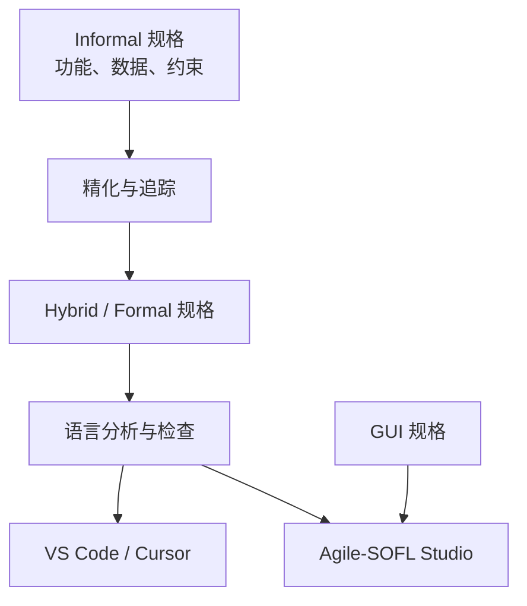
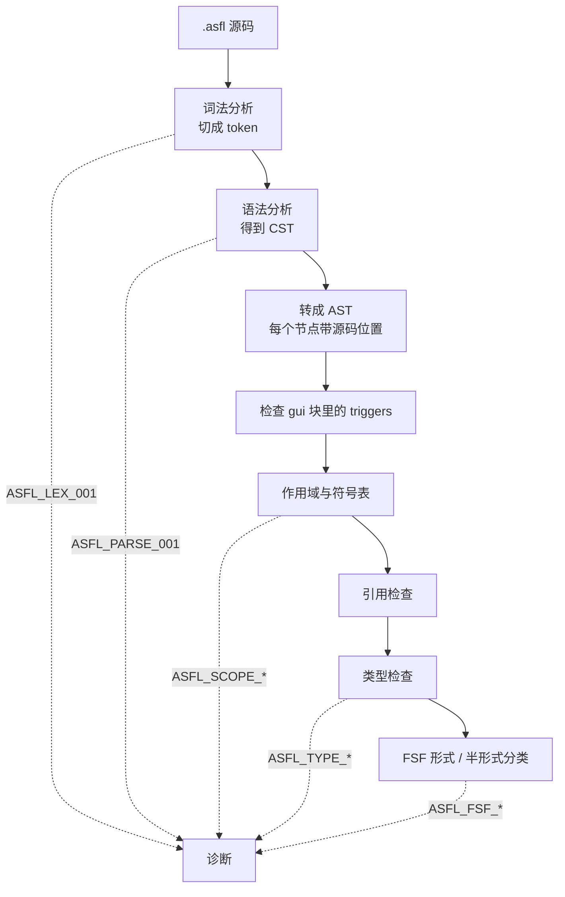
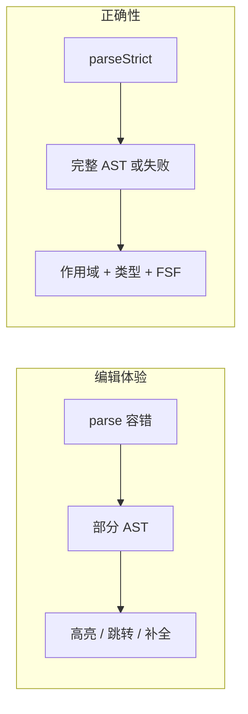
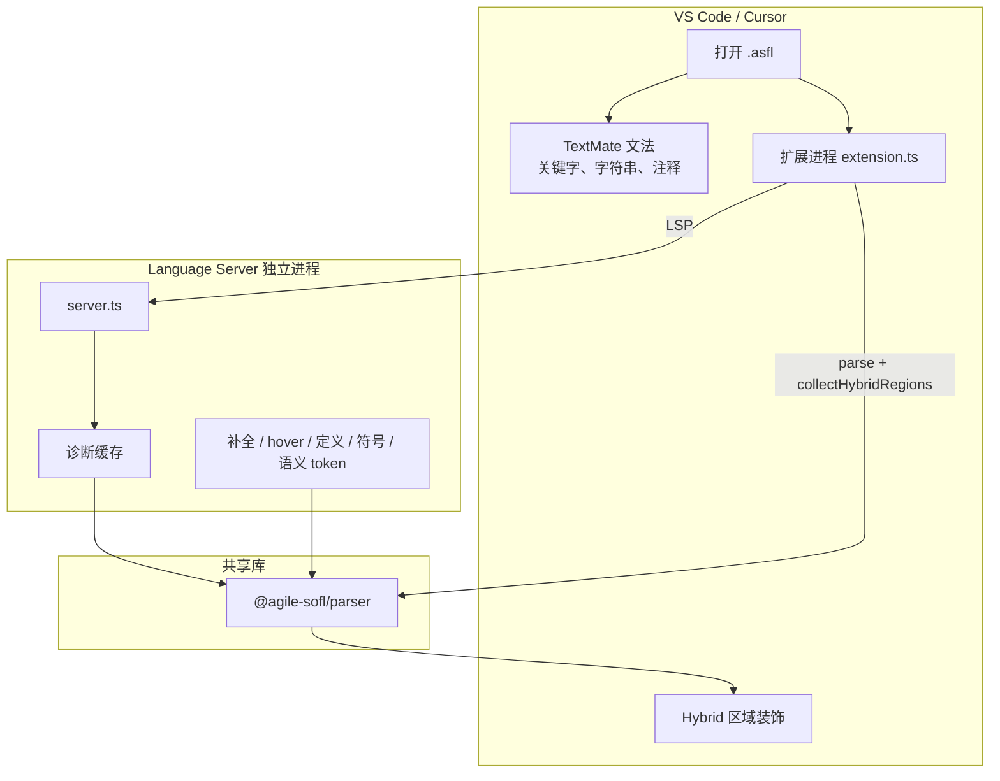
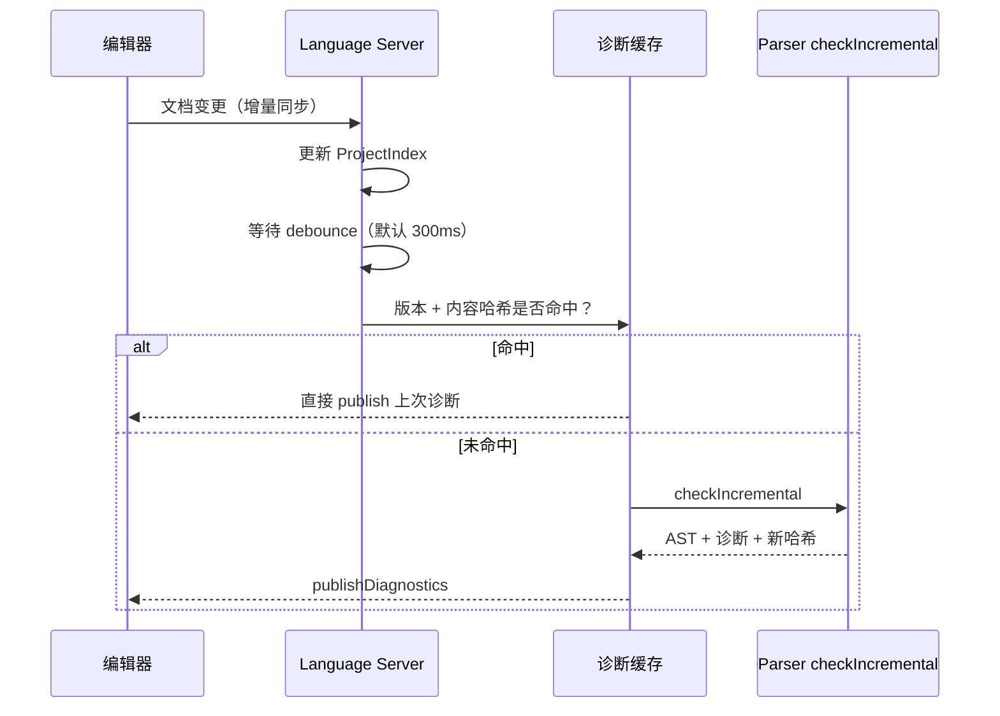

# 工作进度与演进方向

本文回答三个问题：

1. Agile-SOFL 简介。
2. 目前已完成了什么。
3. 接下来的迭代方向。

其中 [第 4 节](#4-我们是怎样实现这门语言的) 会把 **Parser 如何分析 `.asfl`**、以及 **VS Code / Cursor 如何把分析结果变成编辑器能力** 讲清楚。更细的文法与 API 仍以本目录其它文档为准。

---

## 1. 当前进度：已经能做什么

目前，Agile-SOFL 已经不只是语言设想，而是一套可以实际使用的规格工具链。

### 已经完成的核心能力

| 能力 | 当前状态 | 使用者能得到什么 |
|------|----------|------------------|
| Agile-SOFL 语言基础 | **已完成** | 可以描述系统、模块、数据、约束、过程和功能场景 |
| `.asfl` 解析与检查 | **已完成** | 规格可以被机器理解，并能发现语法、名称、类型和场景问题 |
| 非形式规格 `.aspec` | **已完成** | 可以先用自然语言整理功能、数据和约束 |
| Informal → Hybrid 精化 | **已完成** | 可以把早期需求生成可继续完善的 Agile-SOFL 规格骨架 |
| VS Code / Cursor 支持 | **已完成** | 编写规格时有高亮、诊断、补全、跳转和格式化 |
| Studio 可视化编辑 | **已完成** | 可以同时用代码、表单、场景卡片和关系图编辑规格 |
| 需求追踪与覆盖率 | **已完成** | 可以看到一条早期需求是否已经落实到后续规格 |
| GUI 规格 | **MVP + 设计器** | 可描述页面/控件，并用拖拽画布编辑布局与 View 切换 |
| Studio 四栏工作区 | **已完成** | 文件夹项目、SQLite 索引、模块树、项目级 Informal、结构图 |
| AI 辅助形式化 | **下一阶段** | 计划把自然语言场景逐步转成可检查的形式谓词 |

### 一句话概括

当前版本已经打通了这条主线：


其中，前四步已经有可运行的实现。最后一步目前可以由人完成，下一阶段将加入 AI 辅助。

---

## 2. Agile-SOFL 语言在设计什么

软件规格通常有一个两难：

- 只写自然语言，容易沟通，但很难自动检查，也容易出现遗漏和歧义。
- 一开始就写完整形式逻辑，虽然严谨，但学习成本高，也不适合需求仍在变化的阶段。

Agile-SOFL 选择的是中间路线：**允许规格从自然语言开始，经过半形式描述，逐步演化为形式规格。**

它不是要求作者一次把所有内容写得绝对严格，而是让不同成熟度的内容可以同时存在，并且知道下一步该完善什么。

### 2.1 三个规格层次

#### Informal：先把需求说清楚

在最早阶段，重点是记录：

- 系统要提供哪些功能；
- 系统管理哪些数据；
- 有哪些业务规则和限制；
- 用户通过什么界面与系统交互。

这些内容以 `.aspec` 文件保存，主要使用自然语言，不要求作者先掌握谓词和量词。

#### Hybrid：自然语言与形式描述并存

当需求逐渐稳定后，规格会进入 Hybrid 层。

这时已经有明确的模块、类型、状态和过程，但某些条件仍然可以保留为自然语言。例如：

```asfl
process Borrow (member_id: nat, book_id: nat) success: nat
FSF :
informal member and book are valid && success = 1 ||
others && success = 0
end_process
```

这段规格已经说明了过程的输入、输出和主要场景，但“会员和图书有效”仍是一句人话。它可以先保留，等业务规则明确后再形式化。

#### Formal：把关键规则写成可检查的谓词

在更稳定、更底层的过程里，自然语言条件会被明确的谓词替代：

```asfl
process Borrow (member_id: nat, book_id: nat) success: nat
FSF :
member_id > 0 and book_id > 0 && success = 1 ||
others && success = 0
end_process
```

此时工具可以进一步检查名称、类型和场景结构，也为测试生成、证明或模型分析留下基础。

### 2.2 这种设计的重点不是“语法更多”

Agile-SOFL 当前最重要的设计目标有四个：

1. **允许渐进完善**  
   需求不必一次写完。暂时不确定的内容可以明确标为半形式，而不是假装已经精确。

2. **保持结构一致**  
   无论内容处于哪个阶段，都围绕系统、模块、数据、过程和场景组织，不需要每次换一种表达方式。

3. **保持前后可追踪**  
   早期规格中的一项功能，可以追踪到后来的模块、过程和场景。

4. **让规格可以被工具维护**  
   规格不只是文档，还可以被解析、检查、格式化、跳转和可视化编辑。

---

## 3. 当前语言已经支持哪些表达

目前实现的语言子集已经能描述中等规模的系统规格。

### 系统与模块

- 一个系统可以拆成多个模块；
- 模块之间可以表达父子精化关系；
- 模块中可以声明常量、类型、状态变量和不变式；
- 过程可以读取或修改模块状态。

### 过程与功能场景

- 过程可以声明输入和输出；
- 一个过程可以包含多个业务场景；
- 场景由“适用条件”和“结果约束”组成；
- 可以使用 `others` 表示其余情况；
- 高层过程可以继续分解为更具体的过程；
- 相同过程可以在模块之间建立引用关系。

### 数据与逻辑

- 支持整数、实数、布尔值、字符串等基本类型；
- 支持枚举、集合、序列、映射和组合数据；
- 支持条件表达式、量词和集合式表达；
- 支持函数和模块不变式。

### 混合规格

- 场景条件和结果中可以暂时保留自然语言；
- 工具能够区分形式场景与半形式场景；
- 对于应当形式化的底层过程，工具会提示仍未处理的自然语言内容。

### GUI 规格

- 可以描述页面和控件；
- 可以说明按钮等控件会触发哪个过程；
- 可以在 Studio 中查看简单线框；
- GUI 与功能规格可以建立关联。

完整语法边界见 [03-文法参考.md](./03-文法参考.md)，FSF 场景写法见 [05-FSF-规约.md](./05-FSF-规约.md)。

---

## 4. 我们是怎样实现这门语言的

项目实现不是一个单独的 Parser，而是围绕规格生命周期搭建的一组工具。



### 4.1 Parser：把文本变成可检查的规格

Parser 是整条工具链的地基。没有它，编辑器只能当记事本；有了它，诊断、补全、跳转、格式化、可视化写回和精化验收才共用同一套语义。

实现上，它不是手写递归下降，而是用 [Chevrotain](https://chevrotain.io/) 生成词法器与语法分析器。Chevrotain 的好处是：文法规则写在 TypeScript 里，出错位置清楚，并且可以同时提供「尽量解析」和「严格解析」两套实例。

#### 文本如何一步步变成诊断

一份 `.asfl` 会依次走过下面几步。前面失败了，后面故意不跑，避免一堆连带误报。



对应代码入口：

| 你想做什么 | 调用 | 行为 |
|------------|------|------|
| 编辑器里容忍草稿错误 | `parse()` | 默认容错，尽量给出部分 AST |
| CLI / 格式化 / 正式检查 | `parseStrict()` / `check()` | 语法一错就停，不产出半成品树 |
| 只解析一个模块 | `parseModule()` | LSP 单文件场景可用 |
| 看人能读的报告 | `inspect()` / `asfl inspect` | 汇总结构、符号、informal 区域 |
| 统一排版 | `format()` | 先严格解析，再从 AST pretty-print |
| 跨文件跳转 | `ProjectIndex` | 按 URI 缓存 AST 与符号 |
| 标出 FSF / informal / comment | `collectHybridRegions()` | 给编辑器画区域底色 |

日常命令：

```bash
npx asfl inspect examples/library-system.asfl
npx asfl check examples/ecommerce.asfl
npx asfl format examples/hospital-registration.asfl
npx asfl repl
```

#### 词法：先认得出「这是哪个词」

词法器在 `packages/parser/src/lexer/tokens.ts`。关键字全部带词边界 `\b`，所以 `informal` 不会被拆成 `in`，`total` 不会被拆成 `to`。这是 Agile-SOFL 里很实际的问题：语言既有 `in`、`of`、`to` 这类短关键字，又有 `informal`、`end_process` 这类长词。

它还会识别：

- 标识符、整数、实数、字符串、字符、枚举值 `<red>`；
- 多字符运算符 `&&`、`||`、`==`、`<>`、`**`、`SYSTEM_`、`mk_`；
- 块注释 `/* … */`（空白和注释都会被跳过，不进入语法树）。

词法一旦出错，语法分析直接不启动，AST 为 `null`。原因很简单：token 流已经不可信，再往下猜只会制造更离谱的错误。

#### 语法：两套解析器，服务两种场景

语法规则在 `packages/parser/src/parser/parser.ts`，对应 [03-文法参考.md](./03-文法参考.md) 里的 EBNF。Chevrotain 先产出 **CST**（具体语法树，几乎按源码结构保留），再由 `cstToAst.ts` 转成工具真正使用的 **AST**。

这里有一个刻意的设计：**编辑用容错，检查用严格。**



- `parse({ tolerant: true })`（默认）：遇到语法错误仍尝试继续，尽量留下能用的模块 / 过程节点。草稿阶段的补全和语义高亮依赖这个。
- `parseStrict()`：任一语法错误就返回 `null` AST。`check()` 和 `format()` 走这条路，避免把错误文本「格式化」成另一份错误文本。

CST 与 AST 分开，是为了让文法演进时不必同时改所有编辑器逻辑。编辑器和语义分析只认 AST：每个节点有 `type` 字段，并带 `span`（起止偏移、行号、列号），这样波浪线和跳转才能对准源码。

顶层 AST 可以看成：

```text
ProgramNode
 └── modules[]
      ├── consts / types / vars / invariants
      ├── gui?（页面与控件）
      ├── processes[]  → 签名、ext、FSF、decom、comment
      └── functions[]  → 签名、FSF、== 函数体
```

FSF 在树里是场景列表：每条是 `test && def`，可选末尾 `others`。自然语言片段不是注释，而是真正的 `informal_text` 节点，后面的分类器和 Hybrid 装饰都靠它。

#### 语义：名称、类型、以及「够不够形式」

语法通过之后，`check()` 再跑三件事（实现见 [07-语义分析.md](./07-语义分析.md)）：

1. **作用域**  
   为每个模块建符号表，再按 `Child / Parent` 连成模块树。子模块可以读父模块的类型和常量；变量只能在声明它的模块里被 `wr`。未定义名称是 `ASFL_SCOPE_001`，重复模块名是 `ASFL_SCOPE_002`。

2. **类型检查**  
   检查类型别名能否解析、关系式两侧是否兼容、函数体返回值是否对得上声明、内建函数是否写错（编辑距离 ≤ 1 会提示）。`== undefined` 的函数体跳过，因为那是「还没写」的占位。

3. **FSF 分类**  
   遍历场景里的每个原子谓词。只要出现 `informal_text`，整段 FSF 就是半形式。规则与著作分层一致：

   | 过程 | 期望 | 诊断 |
   |------|------|------|
   | 底层（没有 `decom`） | 应当全是谓词 | 仍有人话 → 警告 `ASFL_FSF_001` |
   | 非底层（有 `decom`） | 通常半形式，并带说明 | 已经全是谓词却没有 `comment` → 提示 `ASFL_FSF_002` |
   | 任意过程 | 建议有 `others` | 缺兜底 → 信息 `ASFL_FSF_003` |

这就是「渐进形式化」在 Parser 里的抓手：同一套 FSF 语法，工具始终知道你现在写到哪一层。

#### 给编辑器准备的能力，而不只是「能 parse」

Parser 还暴露了一批编辑器专用 API，VS Code 和 Studio 都用它们，而不是各自再写一套分析：

| API | 用途 |
|-----|------|
| `walk` / `findNodeAtOffset` | 光标落在哪个最小节点上 |
| `resolveReference` | 这个名字指向哪条声明 |
| `collectHybridRegions` | 收集 FSF / informal / comment / decom 区间 |
| `checkIncremental` | 整份源码哈希未变则复用上次结果；并记录每个模块的哈希 |
| `ProjectIndex` | 多文件符号表，支持跨文件定义 |
| `printProgram` | 4 空格语义缩进的 pretty-printer |

当前所谓「增量」主要是 **结果缓存**（内容没变就不重算），还不是复用语法树的真正增量解析。对编辑器手速已经够用：集成规格的单次 `parse` 在 CI 里有 P95 < 100ms 的门槛。

这意味着 Agile-SOFL 规格已经从「可阅读的文本」变成「可计算、可检查、可按位置查询」的数据。

### 4.2 Informal 规格与精化

早期需求使用 `.aspec` 保存，按功能、数据和约束组织。精化工具会把这些内容转成 `.asfl` 骨架：

- 功能转成过程；
- 业务场景转成 FSF 场景；
- 数据转成类型和状态变量；
- 约束转成不变式；
- 模块关系保留为规格结构；
- 原始需求与生成结果之间建立追踪链接。

精化的目标不是自动生成一份“看起来很严谨”的最终规格，而是生成一份**结构正确、来源清楚、可以继续修改**的 Hybrid 规格。

当 `.asfl` 已经被人工修改过时，工具会尽量合并变化，而不是直接覆盖整份文件。

### 4.3 VS Code / Cursor：语言支持是怎么接上 Parser 的

扩展本身几乎不「懂」Agile-SOFL。它做三件事：向 VS Code 注册 `.asfl` 这种语言、用 TextMate 做第一层着色、再拉起 Language Server。真正的分析都在 `@agile-sofl/parser` 里，语言服务器只是把 Parser 的结果翻译成 LSP 协议。



Studio 使用同一份 Language Server 代码：VS Code 扩展通过 IPC 拉起打包进 VSIX 的 `server/server.js`，Studio 则 spawn `dist/server.js --stdio`。两边调用的都是 `@agile-sofl/parser`，所以「在 Studio 里正确的规格，换到 VS Code 里不会变成另一套规则」。

#### 扩展启动之后发生了什么

1. 用户打开 `.asfl`，或工作区里出现 `.asfl`，扩展被激活。
2. `package.json` 把语言 id 登记为 `agile-sofl`，并挂上：
   - TextMate 文法 `syntaxes/agile-sofl.tmLanguage.json`
   - 语言配置 `language-configuration.json`（括号配对、块注释 `/* */`、输入时缩进）
3. `extension.ts` 用 `vscode-languageclient` 拉起打包好的 `server/server.js`。
4. 服务器声明能力：增量文档同步、诊断、格式化、大纲、定义、悬停、补全、折叠、工作区符号、语义高亮。
5. 之后每次按键，编辑器只把变更发给服务器；服务器决定何时调用 Parser。

扩展进程里另外做了两件 **不必经过 LSP** 的事：一份备用格式化（直接调 `format()`），以及 Hybrid 区域装饰（见下文）。诊断、补全、跳转则以服务器为准。

#### 两层着色：先认关键字，再认「这是过程名」

只靠正则的 TextMate 很快就会不够。例如同一个标识符，在类型位置和在过程名位置含义不同；`informal` 短语也需要和普通标识符分开。所以着色是两层叠加：

| 层 | 做什么 | 何时生效 |
|----|--------|----------|
| TextMate | 关键字、数字、字符串、`FSF`、`others`、模块头 | 文件一打开就有，即使还在打草稿 |
| 语义 token | 根据 AST：模块是 namespace、过程是 method、类型是 type、informal 文本是 string | Parser 给出 AST 之后 |
| Hybrid 装饰 | FSF 行左边蓝条；informal / comment / decom 浅底色 | 扩展自己 `parse` 后调用 `collectHybridRegions` |

语义 token 的类型包括 `namespace`、`function`、`method`、`type`、`parameter`、`variable`、`string`、`keyword`。打开默认设置里的 `editor.semanticHighlighting.enabled` 后，TextMate 的颜色仍在，语义层会覆盖「这个词到底是什么」。

Hybrid 装饰是扩展侧的 POC：300ms debounce 后容错解析全文，按区域刷装饰。解析失败则清空装饰，避免把过期底色留在错误文本上。

#### 诊断：停一下再检查，并且能复用上次结果

如果每个按键都跑完整 `check()`，大规格会卡。服务器的策略是：



- 打开文件时立刻检查一次；之后默认等 300ms（可用 `agileSofl.debounceMs` 改）。
- 缓存键是 **文档 version + SHA-256 内容哈希**。
- 真正跑检查时走 `checkIncremental`：整份文本没变就直接返回旧结果。
- Parser 诊断码会映射成 LSP 严重度：语法 / 作用域 / 类型是 Error；`ASFL_FSF_001` 是 Warning；其余 FSF 提示是 Information。

写到一半、语法还不完整时，严格 `check()` 可能没有 AST，这时波浪线主要是 `ASFL_PARSE_001`。补全和跳转则改用容错 `parse()`，所以草稿里往往「还能跳、还能补」，但诊断会先告诉你结构还没闭合。

#### 光标智能：定义、悬停、补全、大纲

这些功能都先把光标位置换成字符偏移，再问 Parser「这里是哪个节点」。

**跳转定义（F12）**

优先查 Language Server 维护的 `ProjectIndex`（已打开的 `.asfl` 都会 `upsert`）。找不到再在当前文件里：容错解析 → `resolveScope` → `resolveReference` / `resolveDeclarationAtOffset`。因此同文件多模块可以跳，已打开的其它文件也可以跳。

**悬停**

按节点类型给出 Markdown：符号的 kind 与类型、过程 / 函数签名、量词或 comprehension 绑定的类型、informal / comment / decom 的摘要。光标在人话短语上时，会明确告诉你这是 informal 文本，而不是普通变量。

**补全（Ctrl+Space，也可由 `:` `.` `/` `[` `|` 触发）**

按「光标所在上下文」而不是抛出全部关键字：

- 写类型时（`:` 后面）：基本类型 + 当前模块及父模块的类型名；
- 表达式里：作用域中的变量、常量、函数，以及过程参数、`ext` 变量；
- 量词 / `{ e | x: T & P }` 里：绑定名；
- 过程体里：`FSF`、`ext`、`decom`、`comment`、`end_process`；
- FSF 里：`others`、`&&`、`||` 以及场景 snippet；
- `gui` 块里：`screen`、控件种类、`triggers`。

当前文件若有不可恢复的语法错误，定义会放弃（避免跳到错误位置）；补全仍尽量用部分 AST。

**大纲与折叠**

`documentSymbol` 列出模块、类型、变量、过程、函数，供大纲视图和面包屑使用。折叠范围来自 AST 上的模块 / 过程 / 函数 / `composed` / `case` 跨度，和语言配置里的 `end_*` 标记是一致的。

**工作区符号**

`Ctrl+T` 一类查询会扫所有已打开文档的符号，按名字过滤。这依赖服务器里的文档集合，不是整盘任意扫描。

#### 格式化与输入时的小帮助

格式化有两条路，规则相同——都是 Parser 的 pretty-printer，4 空格缩进，FSF 每个场景单独一行：

- LSP：`Shift+Alt+F` → 服务器 `format()`；
- 扩展自己也注册了 DocumentFormatting，作为客户端侧备用。

任一路径上，只要还有 error 级诊断，就拒绝格式化，以免把坏掉的规格「美化」成无法对应回原意的文本。

语言配置还处理了括号自动闭合、在 `process` / `FSF :` 后回车缩进、在 `end_process` 前outdent。这些不经过 Parser，只是让输入手感接近普通编程语言。

#### 和 Parser 的分工，一句话

| 层次 | 负责 |
|------|------|
| TextMate + 语言配置 | 还没有 AST 时的着色、括号、缩进 |
| Language Server | 把 Parser 结果变成诊断、补全、跳转、语义 token |
| 扩展进程 | 启动服务器、Hybrid 区域底色、备用格式化 |
| Parser 库 | 唯一的语言事实来源 |

扩展以私有 `.vsix` 分发，不上架 Marketplace。本地可用 F5 打开 Extension Development Host；发版时 Language Server 会被 esbuild 打进 `packages/vscode/server/server.js`，随 VSIX 一起走。更细的安装与开发步骤见 [11-VSCode扩展与LSP.md](./11-VSCode扩展与LSP.md)。

### 4.4 可视化编辑

Agile-SOFL Studio 面向更关注规格结构的用户。

它采用“左侧代码、右侧可视化”的方式，两边编辑的是同一份规格。当前可以通过可视化界面：

- 浏览模块和过程；
- 查看模块之间的关系；
- 编辑常量、类型、变量和不变式；
- 编辑过程签名和 FSF 场景；
- 把复杂谓词拆成更直观的树；
- 编辑函数和 GUI 信息；
- 查看诊断、覆盖率和追踪关系；
- 在代码与可视化内容之间互相定位。

代码始终是最终保存的内容，因此可视化编辑不会产生另一套无法同步的数据。

### 4.5 追踪与覆盖率

工具会记录早期需求与 Hybrid 规格之间的对应关系，从而回答：

- 这项功能是否已经在 `.asfl` 中实现；
- 原来的三个场景是否都被保留下来；
- 两边是否都发生过修改；
- 哪些需求仍然缺失或只完成了一部分。

当前使用四种直观状态：

- **已覆盖**：需求已经落实到后续规格；
- **部分覆盖**：已经有对应结构，但内容还不完整；
- **缺失**：早期需求存在，后续规格中还没有；
- **需要同步**：两边都发生了变化，需要人工确认。

这部分实现让 Agile-SOFL 不只是“写规格”，还能够支持规格长期演化。

---

## 5. 两种编辑方式如何分工

| 使用方式 | 更适合做什么 |
|----------|--------------|
| VS Code / Cursor | 直接写文本、快速修改、查看诊断、与代码一起管理 |
| Agile-SOFL Studio | 四栏工作区：模块树、项目级 Informal 文本、Hybrid 代码/可视化、结构图；GUI 模块可拖拽设计 View |

两种编辑方式共用相同的语言分析和检查规则，因此不会出现“在一个编辑器里正确，换一个编辑器就错误”的情况。

Studio 四栏中 Informal 后续 IDE、GUI 设计器缺口见 [21](./21-Informal-IDE接口与handoff.md)、[22](./22-GUI可视化设计器handoff.md)。

---

## 6. 目前还没有做什么

为了避免把“已有基础”和“已经可用的产品能力”混在一起，下面这些内容目前仍未完成：

- 自动把半形式场景转换成可靠的形式谓词；
- 定理证明和模型检测后端；
- 从形式规格自动生成完整测试；
- 面向超大规格的完整增量语法树；
- 高保真 GUI 原型和运行时界面仿真；
- Informal 列的结构化 IDE / AI 撰写工具（当前仅为项目级纯文本）。

当前项目优先解决的是：**让规格能写、能看、能检查、能追踪、能逐步完善。**

证明、测试生成和更强分析可以建立在这个基础上，但不应替代基础的规格维护能力。

---

## 7. 下一阶段：AI 辅助渐进形式化

下一阶段最重要的方向，是帮助作者把 Hybrid 规格中的自然语言内容逐步改成形式谓词。

这里的目标不是让 AI 一次生成整份规格，而是让它完成范围明确、可以检查的小步骤。

### 计划中的使用方式


例如，一条场景可能经历：

1. 自然语言：会员和图书编号必须有效；
2. Hybrid：`informal member and book ids are valid`；
3. Formal：`member_id > 0 and book_id > 0`。

AI 主要负责第 2 步到第 3 步，并且必须遵守以下原则：

- 每次只修改当前过程或当前场景；
- 修改结果必须通过语言检查；
- 作者可以先看差异，再决定是否接受；
- 不能静默删除原有需求或兜底场景；
- 修改后不能破坏需求追踪和覆盖率；
- 无法确定业务含义时，应当提问，而不是编造规则。

### 推荐的推进顺序

1. **解释规格**：说明错误、场景和谓词含义，不修改文件；
2. **补全结构**：补充遗漏的场景骨架或兜底分支；
3. **局部形式化**：一次转换一个自然语言条件；
4. **一致性检查**：发现相似功能之间的遗漏；
5. **跨层同步**：需求变化时，提示哪些 Hybrid 规格需要更新。

现有的 Parser、场景模型、可视化谓词编辑、修改预览、追踪和覆盖率，已经为这条路线准备好了基础。

---

## 8. 更远的演进方向

在 AI 局部形式化稳定后，可以继续探索：

- 根据形式场景生成测试数据和测试用例；
- 将关键性质接入证明器或模型检查器；
- 分析一次规格变更可能影响哪些过程和场景；
- 提升大型、多文件规格的编辑性能；
- 加强 GUI 控件、过程参数和系统状态之间的关联。

这些方向都建立在同一个前提上：规格必须始终可理解、可检查、可追踪，而不是只生成一段看似正确的形式文本。

---

## 9. 从哪里开始

| 想了解的内容 | 推荐阅读或操作 |
|--------------|----------------|
| Agile-SOFL 方法 | [01-Agile-SOFL-介绍.md](./01-Agile-SOFL-介绍.md) |
| 语言整体结构 | [02-语言概览.md](./02-语言概览.md) |
| 当前语法范围 | [03-文法参考.md](./03-文法参考.md) |
| FSF 场景 | [05-FSF-规约.md](./05-FSF-规约.md) |
| Parser 流水线与 AST | [06-解析器与AST设计.md](./06-解析器与AST设计.md) |
| 作用域、类型、FSF 分类 | [07-语义分析.md](./07-语义分析.md) |
| Parser API 与 CLI | [08-API与CLI.md](./08-API与CLI.md) |
| VS Code / Cursor 支持 | [11-VSCode扩展与LSP.md](./11-VSCode扩展与LSP.md) |
| Studio 可视化编辑 | [15-Studio可视化编辑器.md](./15-Studio可视化编辑器.md) |
| Informal 与 Hybrid 精化 | [17-Informal与Hybrid规格编辑器设计.md](./17-Informal与Hybrid规格编辑器设计.md) |
| GUI 规格 | [18-GUI规格模块设计.md](./18-GUI规格模块设计.md) |

仓库中也提供了图书馆、银行、电商和医院挂号等示例，可以直接查看从模块、数据到过程场景的完整写法。

---

## 总结

Agile-SOFL 的核心不是要求人一开始就写出完美的形式规格，而是让规格能够从自然语言出发，在工具支持下逐步变得清晰、结构化和可检查。

目前，我们已经实现了语言解析、规格检查、Informal 到 Hybrid 精化、文本编辑、可视化编辑、GUI 规格、追踪和覆盖率。下一步将重点建设 AI 辅助形式化，让自然语言到形式谓词的每一次变化都可以检查、预览、接受或拒绝，并且始终保留与原始需求的联系。
